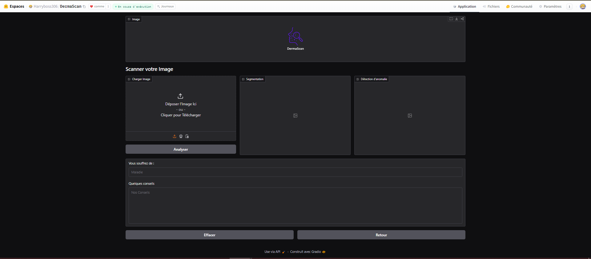
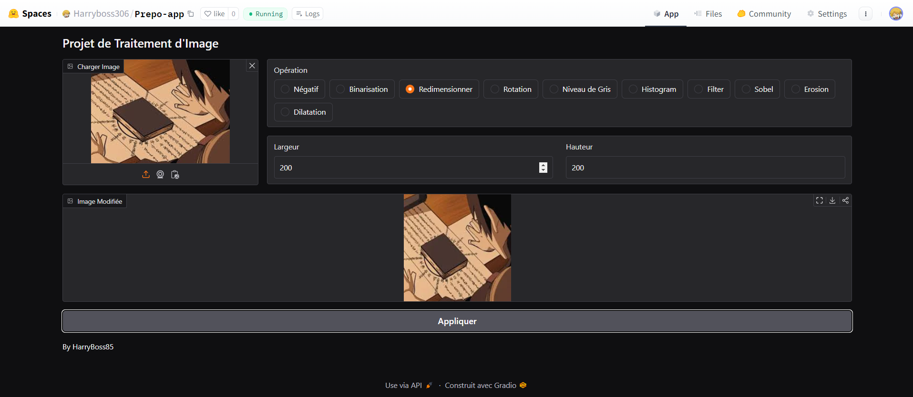
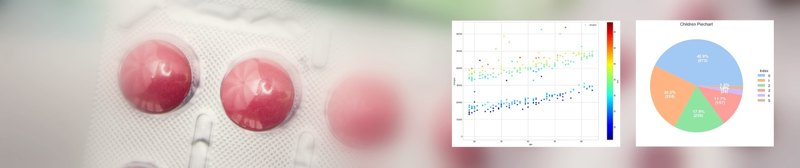

# Artificial Intelligence

## Data science, Computer Vision, Machine Learning and Deep Learning

- Email : miguelanago85@gmail.com
- Phone : +229 59 32 05 93
- LinkedIn : https://www.linkedin.com/in/miguel-anago-a939a9292/
- Github : https://github.com/HarryMiguel306

### About me

Passionate about IT as a whole, I have varied expertise covering a wide range of areas such as graphic design, web design, web development especially on the frontend side and artificial intelligence above all... My goal is to design innovative IT solutions capable of solving local problems and, ideally, contributing to global solutions.

### Education

- Degree in Artificial Intelligence at the Institute for Training and Research in Computer Science (IFRI).
- Baccalaureate in scientific series C with honors at the Malanhoui General Education College.

### Skills
Programming language mastered :
- Python, R, Java, C++, C, SQL...
- HTML, CSS, JavaScript...

Another area of ​​expertise :
- Web mockup with figma and Adobe xd
- Canva for graphic design

### Project
AI Projects such as :

-[DermaScan](https://huggingface.co/spaces/Harryboss306/DermaScan)

DermaScan is an application designed to facilitate the analysis of skin lesions using dermoscopic images. This project is currently in its MVP (Minimum Viable Product) phase and focuses on the detection and segmentation of skin anomalies from user-provided images. The goal is to offer a simple and fast solution to assist in the identification of skin diseases, while providing an intuitive and easy-to-use interface.[See MVP here](https://huggingface.co/spaces/Harryboss306/DermaScan)

- [Prepo-App](https://huggingface.co/spaces/Harryboss306/Prepo-app)

Prepo-App is an image preprocessing application that I developed and deployed on Hugging Face. This tool simplifies image preprocessing tasks by leveraging a range of powerful dependencies such as **PIL**, **matplotlib**, **numpy**, **gradio**, and **OpenCV**. It allows users to easily upload images, apply various transformations (e.g., resizing, sobel, dilatation, erosion...), and visualize the results in real-time. Designed for developers and data scientists, Prepo-App enhances efficiency in preparing images for machine learning models or other applications.[Try it here](https://huggingface.co/spaces/Harryboss306/Prepo-app)

- [Health insurance](https://www.kaggle.com/datasets/teertha/ushealthinsurancedataset)

The data (available under Kaggle) used in this lab is real data from a US insurance company X and is useful for predicting health insurance premiums for a US citizen. [See code here](https://github.com/HarryMiguel306/harryboss85.github.io/blob/main/ProjetML.ipynb)

- [Boston Housing](https://www.kaggle.com/datasets/arunjangir245/boston-housing-dataset)

The Boston Housing Dataset is a classic and widely-used resource in the field of machine learning and statistics that are used to predict average price of a house

- [Oxford Pets](https://www.kaggle.com/datasets/tanlikesmath/the-oxfordiiit-pet-dataset)

Development of a classification model capable of recognizing and classifying images of different breeds of cats and dogs from the Oxford Pets dataset. [See Code here](https://colab.research.google.com/drive/1gkLR0y59QtVxLVzO8h0jSZVKQRqn2rbV?hl=fr#scrollTo=N7b727NEalyf)

### Certification 

- Obtaining the TensorFlow Free Certificate TensorFlow Keras Bootcamp from OpenCV University
- OpenClassroom certification about Data science

### Activities and Engagement
- #### SMART-B : member
- #### Isheero : following

 

